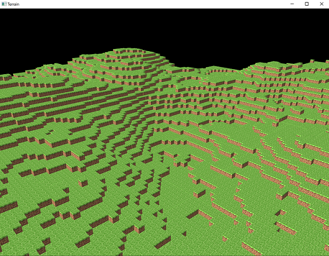
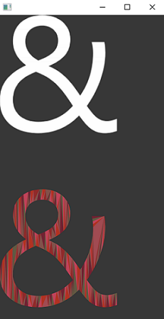
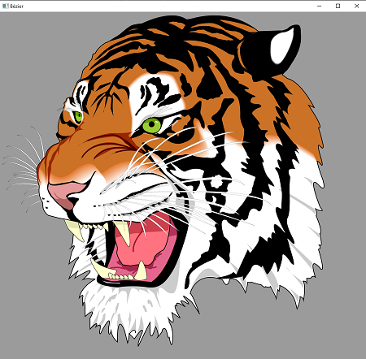

# Windowing Toolkit

This repository provides building blocks to write __GUI__ applications.

Because the aim here is to continuously reinvent the wheel in __pure .NET__, this code only relies on __[.NET Core](https://dotnet.microsoft.com/download) 3.0 64bit__, and on a minimal set of functionalities from those APIs:
* Win32 on __Windows__
* Cocoa on __macOS__
* Xlib on __Linux__
* the __OpenGL__ libraries shipped with those three operating systems.

Native interoperability with these APIs is achieved in C# through __P/Invoke__.

## Examples

The code is developed on Windows 10 64bit, macOS Catalina, and Ubuntu 18.04 64bit installed in a virtual machine.
Once .NET Core is installed, examples and tests work out-of-the-box.

To run samples of window creation, event handling, and OpenGL rendering, use the command:
```
dotnet run -p test/WindowSystem.ManualTest
```
Then follow the instructions in the console and you may see something similar to this:





## Modules

### WindowSystem project

It provides classes to create main windows and to handle events.

See [this sample](test/WindowSystem.ManualTest/WindowsLauncher.cs).

### RasterGraphics project

It provides classes to manipulate raster images. For instance BMP and PNG images can be loaded.

See [this sample](test/WindowSystem.ManualTest/DrawTextureLauncher.cs) to know how to display the image
in BMP format of a cute kitty.

### Tessellation project

It provides types to transform arbitrary polygons into graphics primitives.

[This sample](test/WindowSystem.ManualTest/TessellationLauncher.cs) allows the user to draw a polygon and
to tessellate it interactively.

### Geometry project

It provides types to make computations on curves.

### Typography.Font project

It provides types to decode CFF and TTF font formats.

### Typography.Rasterization project

It provides types to rasterize font glyphs.

[This sample](test/WindowSystem.ManualTest/GlyphLauncher.cs) demonstrates rendering of both rasterized and
tessellated glyphs loaded from a TTF file.

### VectorGraphics project

It provides types to render vector graphics.

[This sample](test/WindowSystem.ManualTest/BezierLauncher.cs) shows how to display simple SVG files.

### OpenGL.Context project

It provides classes to associate OpenGL contexts to windows.

The rendering of everything in this repository relies on OpenGL ES 2/3.3 because that version is available everywhere.
Theoretically the code is structured in a way that allows any library that can render plain color and
textured triangles to be used instead. And even more theoretically, any library that supports GPU command buffers
(such as Vulkan, Direct3D, or Metal) might achieve great performances.

#### OpenGL bindings

A tool is provided (`dotnet run -p build/MakeOpenGLInterop`) that generates C# OpenGL bindings automatically from
[the file](build/MakeOpenGLInterop/gl.xml) used to generate the official C headers, from
[a file](build/MakeOpenGLInterop/gl_override.xml) written for this tool that tries to fix the mess in the first file,
and from [an input file](test/WindowSystem.ManualTest/glinterop.xml) listing the wanted APIs.

## Acknowledgments

* **OpenGL.Context** and **WindowSystem** projects borrow some ideas from [GLFW](https://github.com/glfw/glfw) and [SDL](https://www.libsdl.org/)
* **Tessellation** project is based on the algorithm from [GLU libtess](https://gitlab.freedesktop.org/mesa/glu/tree/master/src/libtess)
* **Geometry** project is approximating Bézier curves using recursive subdivision as described in an article on
antigrain.com (site mostly down).
* **Typography.Rasterization** project is inspired by [that article](http://nothings.org/gamedev/rasterize/).
